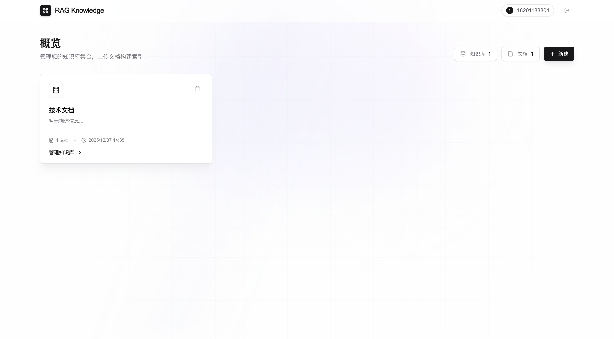
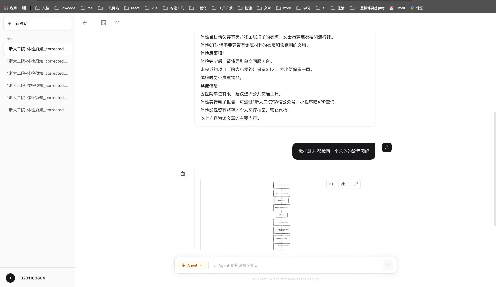

# RAG 知识库系统

> 半天写Demo，半年难上线。我就不信了，前端写不好 RAG

一个支持 **Agentic RAG** 的智能知识库系统，可上传文档、语义检索、智能问答。

## 演示截图

<div align="center">
  
  <br/><br/>
  
</div>

## 核心功能

- **文档管理**: 支持 PDF、DOCX、TXT、MD 等格式上传和索引
- **智能问答**: 基于知识库内容的精准上下文问答
- **Agentic RAG**: ReAct Agent 可自主选择工具进行多轮推理

### Agent 工具箱

| 工具 | 功能 |
|------|------|
| `search_knowledge` | 精准检索（Top-3） |
| `deep_search` | 深度检索（Top-8） |
| `summarize_topic` | 主题总结 |
| `web_search` | 搜索互联网 |
| `get_current_datetime` | 获取当前日期时间 |
| `fetch_webpage` | 抓取网页内容 |

## 快速开始

### 1. 安装依赖

```bash
pnpm install
```

### 2. 环境配置

创建 `.env` 文件：

```env
DATABASE_URL="file:./dev.db"
NEXTAUTH_URL=http://localhost:3000
NEXTAUTH_SECRET=your-secret-key

# Qwen API (阿里云)
OPENAI_API_KEY=sk-xxxxxxxxxxxxxxxxxxxx
OPENAI_MODEL=qwen-turbo
OPENAI_API_BASE=https://dashscope.aliyuncs.com/compatible-mode/v1
```

### 3. 初始化数据库

```bash
npx prisma generate
npx prisma db push
```

### 4. 启动

```bash
pnpm dev
```

访问 http://localhost:3000

## 许可证

MIT
