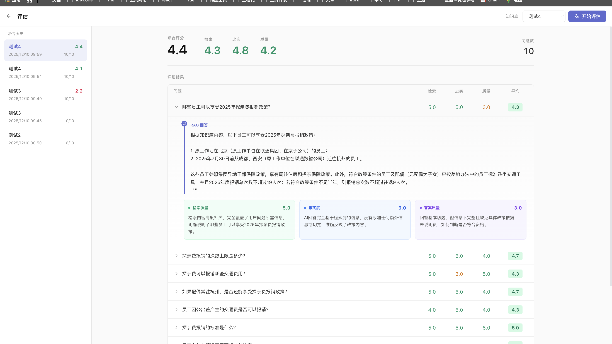

# RAG 知识库系统

> 半天写Demo，半年难上线

一个支持 **Agentic RAG** 的智能知识库系统

## 演示截图

<div align="center">
  
  <p><em>知识库管理</em></p>
  <br/>
  
  <p><em>智能问答</em></p>
  <br/>
  
  <p><em>RAG 评估系统</em></p>
</div>

## 核心功能

- **文档管理**: 支持 PDF、DOCX、TXT、MD 等格式上传和索引
- **智能问答**: 基于知识库内容的精准上下文问答
- **Agentic RAG**: ReAct Agent 可自主选择工具进行多轮推理
- **混合搜索**: 向量检索 + 关键词检索，RRF 融合排序
- **AI 图表生成**: 两步 LLM 生成（逻辑分析 → Mermaid），确保流程正确
- **意图驱动**: LLM 自动识别用户意图，智能路由到合适的工具
- **质量评估**: 回答质量自动检测，低质量时自动重试（最多 3 次）
- **RAG 评估系统**: 四维度 LLM Judge 自动评分，支持 SSE 实时进度推送

### Agent 工具箱

| 工具 | 功能 |
|------|------|
| `search_knowledge` | 精准检索（Top-3，混合搜索） |
| `deep_search` | 深度检索（Top-8，混合搜索） |
| `summarize_topic` | 主题总结（直接读取原文） |
| `keyword_search` | 关键词精确搜索（Meilisearch） |
| `web_search` | 搜索互联网（SearXNG） |
| `get_current_datetime` | 获取当前日期时间 |
| `fetch_webpage` | 抓取网页内容 |
| `generate_diagram` | 生成可视化图表（流程图/时序图） |

### 智能意图识别

Agent 会自动分析用户问题的意图：

| 意图类型 | 示例 | 处理方式 |
|----------|------|----------|
| `greeting` | "你好" | 直接回复，跳过 Agent |
| `small_talk` | "今天天气怎么样" | 直接回复 |
| `document_summary` | "xxx讲了什么" | 调用 summarize_topic |
| `knowledge_query` | "什么是RAG" | 调用 search_knowledge |
| `draw_diagram` | "画个流程图" | 调用 generate_diagram |
| `web_search` | "最新的AI新闻" | 调用 web_search |
| `datetime` | "现在几点" | 调用 get_current_datetime |

### 执行链路追踪

每次查询会记录完整的执行链路，用于质量评估：

```
1. 用户问题 → 2. 意图判断 → 3. 预检索 → 4. Agent工具调用 → 5. 质量评估 → 6. 最终回答
```

## 技术架构

```
┌─────────────────────────────────────────────────────────────┐
│                      用户查询                                │
└──────────────────────────┬──────────────────────────────────┘
                           ▼
┌─────────────────────────────────────────────────────────────┐
│                    意图分析 (LLM)                            │
│   greeting → 直接回复 │ knowledge_query → Agent 处理         │
└──────────────────────────┬──────────────────────────────────┘
                           ▼
┌─────────────────────────────────────────────────────────────┐
│                    预检索 (Pre-retrieval)                    │
│            混合搜索 = 向量检索 + 关键词检索                    │
└──────────────────────────┬──────────────────────────────────┘
                           ▼
┌─────────────────────────────────────────────────────────────┐
│                    ReAct Agent                               │
│   ┌──────────┬──────────┬──────────┬──────────┐            │
│   │ 知识检索  │ 网页搜索  │ 图表生成  │ 主题总结  │            │
│   └──────────┴──────────┴──────────┴──────────┘            │
└──────────────────────────┬──────────────────────────────────┘
                           ▼
┌─────────────────────────────────────────────────────────────┐
│                    质量评估 (LLM)                            │
│         通过 → 返回 │ 不通过 → 重试 (最多3次)                 │
└─────────────────────────────────────────────────────────────┘
```

### RAG 评估系统

系统内置四维度 LLM Judge 评估框架，支持**自动生成评估问题**，对 RAG 系统进行全面的自动化评测：

```
┌─────────────────────────────────────────────────────────────┐
│                      评估流程                                │
└──────────────────────────┬──────────────────────────────────┘
                           ▼
┌─────────────────────────────────────────────────────────────┐
│       自动生成评估问题 (根据知识库内容)                       │
│   ┌──────────────────────────────────────────────┐         │
│   │ 固定问题(2个):                                │         │
│   │   • 总结知识库文档内容 (必选)                   │         │
│   │   • 时间查询/天气查询 (二选一)                  │         │
│   │ 动态问题(8个): LLM 根据文档内容生成             │         │
│   └──────────────────────────────────────────────┘         │
└──────────────────────────┬──────────────────────────────────┘
                           ▼
┌─────────────────────────────────────────────────────────────┐
│           逐个问题调用 Agentic RAG 获取回答                    │
└──────────────────────────┬──────────────────────────────────┘
                           ▼
┌─────────────────────────────────────────────────────────────┐
│                 四维度 LLM Judge 评分                         │
│   ┌──────────┬──────────┬──────────┬──────────┐            │
│   │ 检索质量  │  忠实度  │ 答案质量  │ 工具调用  │            │
│   │Retrieval │Faithful  │ Quality  │   Tool   │            │
│   │ (0-5分)  │ (0-5分)  │ (0-5分)  │ (0-5分)  │            │
│   └──────────┴──────────┴──────────┴──────────┘            │
└──────────────────────────┬──────────────────────────────────┘
                           ▼
┌─────────────────────────────────────────────────────────────┐
│           SSE 实时推送 → 前端展示评估进度                      │
└─────────────────────────────────────────────────────────────┘
```

**评估问题自动生成**：无需手动编写 eval.json，系统根据每个知识库的实际内容自动生成针对性的评估问题。

| 评估维度 | 说明 | 评分标准 |
|----------|------|----------|
| **检索质量** | 检索内容与问题的相关性 | 5分=高度相关，0分=完全无关 |
| **忠实度** | 回答是否基于检索内容，是否存在幻觉 | 5分=无幻觉，0分=完全幻觉 |
| **答案质量** | 正确性、完整性、清晰度 | 5分=优秀，0分=无效 |
| **工具调用** | Agent 工具选择是否合理 (Agentic RAG 特有) | 5分=最优选择，0分=完全错误 |

> 💡 对于 web_search、get_current_datetime 等工具类问题，检索质量和忠实度会自动适配评估策略。

### 混合搜索原理

```
         用户查询
            │
     ┌──────┴──────┐
     ▼             ▼
┌─────────┐  ┌─────────┐
│ 向量检索 │  │关键词检索│
│(语义相似)│  │(精确匹配)│
│LlamaIndex│  │Meilisearch│
└────┬────┘  └────┬────┘
     │             │
     └──────┬──────┘
            ▼
     ┌─────────────┐
     │ RRF 融合排序 │
     │score = Σ 1/(k+rank)│
     └─────────────┘
            │
            ▼
       融合后结果
```

## 快速开始

### 1. 安装依赖

```bash
pnpm install
```

### 2. 环境配置

创建 `.env` 文件：

```env
DATABASE_URL="file:./dev.db"
NEXTAUTH_URL=http://localhost:3000
NEXTAUTH_SECRET=your-secret-key

# Qwen API (阿里云)
OPENAI_API_KEY=sk-xxxxxxxxxxxxxxxxxxxx
OPENAI_MODEL=qwen-turbo
OPENAI_API_BASE=https://dashscope.aliyuncs.com/compatible-mode/v1

# Meilisearch (可选，用于关键词搜索)
MEILISEARCH_HOST=http://localhost:7700
MEILISEARCH_API_KEY=your-master-key
```

### 3. 初始化数据库

```bash
npx prisma generate
npx prisma db push
```

### 4. 启动 Meilisearch (可选)

本地 Docker 部署：

```bash
./deploy-meilisearch.sh
```

或远程服务器部署：

```bash
./deploy-meilisearch-remote.sh
```

### 5. 启动应用

```bash
pnpm dev
```

访问 http://localhost:3000

## 目录结构

```
src/
├── app/                    # Next.js App Router
│   ├── api/               # API 路由
│   │   ├── chat/          # 聊天接口
│   │   ├── documents/     # 文档处理
│   │   ├── eval/          # 评估系统接口
│   │   │   ├── generate/  # 评估问题生成 API
│   │   │   └── stream/    # SSE 实时进度推送
│   │   └── knowledge-bases/ # 知识库管理
│   ├── chat/[id]/         # 聊天页面
│   └── dashboard/         # 管理页面
│       ├── [id]/          # 知识库详情页
│       └── eval/          # RAG 评估页面
├── components/            # React 组件
│   └── DiagramMessage.tsx # 图表渲染组件 (Excalidraw)
├── lib/                   # 核心库
│   ├── llm.ts            # LLM 服务 & Agentic RAG
│   ├── meilisearch.ts    # Meilisearch 服务
│   ├── hybrid-search.ts  # 混合搜索 & RRF 融合
│   ├── mermaid-cleaner.ts # Mermaid 语法清洗
│   ├── eval-generator.ts # 评估问题自动生成
│   ├── eval-service.ts   # 评估服务（运行评测、保存结果）
│   └── eval-judges.ts    # 四维度 LLM Judge
├── types/                 # TypeScript 类型
```

# 启动开发环境
./dev.sh start

# 查看状态
./dev.sh status
# 输出：
# ═══════════════════════════════════════
#         RAG 开发环境状态
# ═══════════════════════════════════════
# 🕸️  LightRAG:  运行中 (PID: 1234)
#    └─ http://localhost:8005/health
# 🌐 Next.js:   运行中 (PID: 5678)
#    └─ http://localhost:3000

# 停止
./dev.sh stop

## 许可证

MIT
